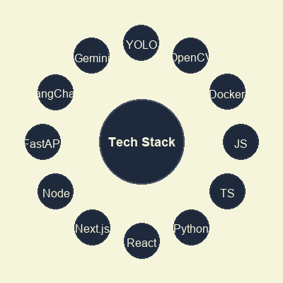

  

---

## About Me

I'm a fresh AI Engineering graduate from Delta University in Mansoura, Egypt. Over the past few years I've been building full-stack products that combine modern web development with AI — from SaaS platforms and RAG-powered tutors to computer vision systems and mobile apps.

I care about shipping real products, not just tutorials. I've published an app on the Play Store, built SaaS tools used by real users, and worked on freelance projects from idea to deployment.

Right now I'm looking for an AI Engineer or Full-Stack role where I can contribute to meaningful products while continuing to grow in LLMs, RAG, and MLOps.

---

## Tech Stack

  

  
  
  
  
  
  
  
  
  
  
  
  
  
  
  

---

## Connect

  
  &nbsp;&nbsp;
  
  &nbsp;&nbsp;
  

